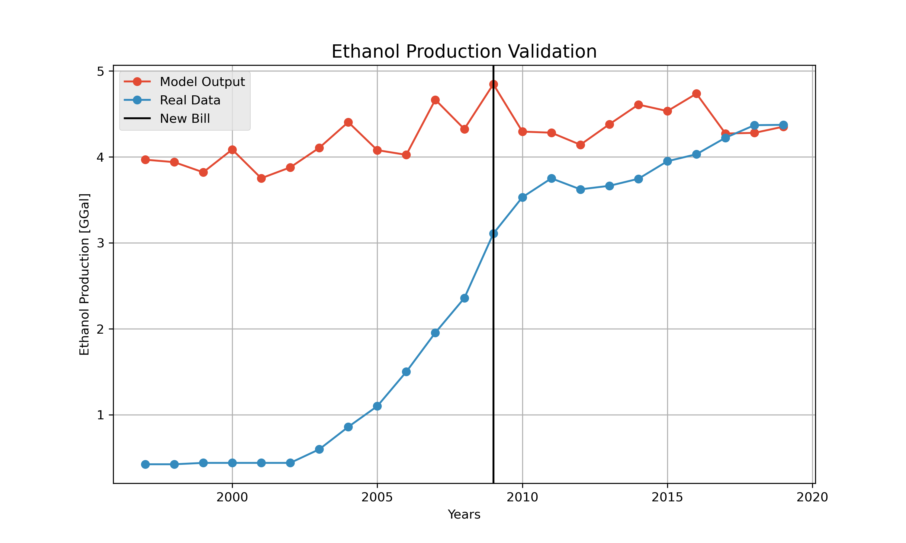

Application
============

Once you can run the model and generate the output, we have two scripts that post-process and analyze the output with visualizations.
The tools are coded in Jupyter Notebook and were developed such that the code blocks must be executed in series. 
Additonal python packages required by the tools are listed at the top and can be found in counda-forge.
Both tools load the output file from the model and make visualizations based on the output variables.

--------------------
Plotting Tool
--------------------

This tool generates the validation plot for the Energy subsystem using EIA data of ethanol produced in Iowa and compares it with the modelled production of Ethanol.
Additionally, the tool also generates an interactive widget, which can plot the time series of variables outputted by the model for a specific county.
The widget includes all 99 counties of Iowa and can plot all the modelled output variables. The function of the code blocks are explained below:
 
 #. Imports the required packages ::

      import os
      import numpy as np
      import pandas as pd
      from matplotlib import pyplot as plt
      import ipywidgets as widgets

 #. Read the output file generated by the batch analysis script and defines the required widgets ::

      # Load Result Data
      loc_R = 'Data_Output/Results.csv'
      df_result = pd.read_csv(loc_R)

      # Parse Result Data
      ns_data = df_result.iloc[:, 0]
      yc_data = df_result.iloc[:, 1]
      ys_data = df_result.iloc[:, 2]     
      ep_data = df_result.iloc[:, 3]

      # Load Animal Agriculture Data
      loc_AA = 'Data_Input/animal_agriculture_data/IFEW_Counties_1997_2019.csv'
      df_AA = pd.read_csv(loc_AA) # Animal Agricultural dataframe

      # Parse Animal Agricultural Data
      yc_real = df_AA["CornGrainYield_bupacre"]
      ys_real = df_AA["SoybeansYield_bupacre"]

      years = pd.Series(range(1997, 2020))

      # Load Energy Validation Data
      loc_NRG = 'Data_Validation/Iowa Historical Ethanol and Biodiesel Production EIA.csv'
      df_AA = pd.read_csv(loc_NRG)

      # Parse Energy Validation Data
      val_nrg_yr = df_AA["Year"]
      val_nrg_bd = df_AA["BDPRP"] * 42 / 1e6 # Thousand of Barrels to MGal
      val_nrg_ep = df_AA["ENPRP"] * 42 / 1e6 # Thousand of Barrels to MGal
      tot_ep = np.zeros(len(years))

      # Define Dropdown Widget
      county_dropdown = widgets.Dropdown(
         options=[('Adair', 1), ('Adams', 2), ('Allamakee', 3), ('Appanoose', 4), ('Audubon', 5), ('Benton', 6), ('Black Hawk', 7), ('Boone', 8), ('Bremer', 9), ('Buchanan', 10), ('Buena Vista', 11), ('Butler', 12), ('Calhoun', 13), ('Carroll', 14), ('Cass', 15), ('Cedar', 16), ('Cerro Gordo', 17), ('Cherokee', 18), ('Chickasaw', 19), ('Clarke', 20), ('Clay', 21), ('Clayton', 22), ('Clinton', 23), ('Crawford', 24), ('Dallas', 25), ('Davis', 26), ('Decatur', 27), ('Delaware', 28), ('Des Moines', 29), ('Dickinson', 30), ('Dubuque', 31), ('Emmet', 32), ('Fayette', 33), ('Floyd', 34), ('Franklin', 35), ('Fremont', 36), ('Greene', 37), ('Grundy', 38), ('Guthrie', 39), ('Hamilton', 40), ('Hancock', 41), ('Hardin', 42), ('Harrison', 43), ('Henry', 44), ('Howard', 45), ('Humboldt', 46), ('Ida', 47), ('Iowa', 48), ('Jackson', 49), ('Jasper', 50), ('Jefferson', 51), ('Johnson', 52), ('Jones', 53), ('Keokuk', 54), ('Kossuth', 55), ('Lee', 56), ('Linn', 57), ('Louisa', 58), ('Lucas', 59), ('Lyon', 60), ('Madison', 61), ('Mahaska', 62), ('Marion', 63), ('Marshall', 64), ('Mills', 65), ('Mitchell', 66), ('Monona', 67), ('Monroe', 68), ('Montgomery', 69), ('Muscatine', 70), ('Obrien', 71), ('Osceola', 72), ('Page', 73), ('Palo Alto', 74), ('Plymouth', 75), ('Pocahontas', 76), ('Polk', 77), ('Pottawattamie', 78), ('Poweshiek', 79), ('Ringgold', 80), ('Sac', 81), ('Scott', 82), ('Shelby', 83), ('Sioux', 84), ('Story', 85), ('Tama', 86), ('Taylor', 87), ('Union', 88), ('Van Buren', 89), ('Wapello', 90), ('Warren', 91), ('Washington', 92), ('Wayne', 93), ('Webster', 94), ('Winnebago', 95), ('Winneshiek', 96), ('Woodbury', 97), ('Worth', 98), ('Wright', 99)],
         description='County:',
         disabled = False)

 #. Generates the validation plot for Ethanol ::

      # Creates Directory
      if not os.path.exists("Figures"):
         os.mkdir("Figures")
      if not os.path.exists("Figures/Validation"):
         os.mkdir("Figures/Validation")
         
      for year in years:
         i = year - 1997
         values = ep_data.iloc[range(i, len(ep_data), 23)]
         tot_ep[i] = np.sum(values) / 1e9 # Convert to MGal

      fig0, ax0 = plt.subplots(figsize=(10,6))
      plt.style.use('ggplot')
      ax0.plot(years, tot_ep, "C0o-")
      ax0.plot(val_nrg_yr.iloc[range(val_nrg_yr[val_nrg_yr == 1997].index.values[0], val_nrg_yr[val_nrg_yr == 2020].index.values[0])], val_nrg_ep.iloc[range(val_nrg_yr[val_nrg_yr == 1997].index.values[0], val_nrg_yr[val_nrg_yr == 2020].index.values[0])], "C1o-")
      ax0.axvline(x = 2009, color = "black")
      # Plot Labels
      ax0.set_title("Ethanol Production Validation")
      ax0.set_xlabel("Years")
      ax0.set_ylabel("Ethanol Production [GGal]")
      ax0.legend(["Model Output", "Real Data", "New Bill"], loc ="best")

      ax0.grid(True)

 #. Save the plot if desired ::

      fig_name = "Figures/Validation/Ethanol Production.png"
      fig0.savefig(fig_name, dpi = 300)      
      
 #. Define a function to generate the desired plot based on the inputs of the widget ::

      def plot_function(county_no):

         fig1 = plt.figure(figsize =(10, 5))
         plt.style.use('ggplot')
         # Model Outputs
         plt.plot(years, ns_data.iloc[(county_no - 1) * 23 : 23 + (county_no - 1) * 23], 'C0o')
         # # Regression Line - Polyfit
         # rl_coeffs = np.polyfit(years, ns_data.iloc[(county_no - 1) * 23 : 23 + (county_no - 1) * 23], 3)
         # rl_eq = np.poly1d(rl_coeffs)
         # rl_x = np.linspace(1997, 2019, 100)
         # rl_y = rl_eq(rl_x)
         # plt.plot(rl_x, rl_y, 'C1.-')
         # Plot Labels
         plt.title("Modelled Nitrogen Surplus Trend")
         plt.xlabel("Years")
         plt.ylabel("Nitrogen Surplus (kg/ha)")
         # plt.legend(["Model Output", "Regression Fit"], loc ="best")
         plt.grid(True)
         plt.show()
         
         fig2 = plt.figure(figsize =(10, 5))
         plt.style.use('ggplot')
         # Model Outputs
         plt.plot(years, yc_data.iloc[(county_no - 1) * 23 : 23 + (county_no - 1) * 23], 'C0.-')
         # Real Data
         plt.plot(years, yc_real.iloc[(county_no - 1) * 23 : 23 + (county_no - 1) * 23], 'C1.-')
         # Plot Labels
         plt.title("Modelled Corn Yield Trend")
         plt.xlabel("Years")
         plt.ylabel("Corn Yield (bu/acre)")
         plt.legend(["Model Output", "Real Data"], loc ="best")
         plt.grid(True)
         plt.show()
         
         fig3 = plt.figure(figsize =(10, 5))
         plt.style.use('ggplot')
         # Scatter - Model Outputs
         plt.plot(years, ys_data.iloc[(county_no - 1) * 23 : 23 + (county_no - 1) * 23], 'C0.-')
         # Real Data
         plt.plot(years, ys_real.iloc[(county_no - 1) * 23 : 23 + (county_no - 1) * 23], 'C1.-')
         # Plot Labels
         plt.title("Modelled Soybean Yield Trend")
         plt.xlabel("Years")
         plt.ylabel("Soybean Yield (bu/acre)")
         plt.legend(["Model Output", "Real Data"], loc ="best") 
         plt.grid(True)
         plt.show()

 #. Generates the interactive widget ::

      widgets.interact(plot_function, county_no = county_dropdown)

The ethanol validation plot with the modelled ethanol production and EIA data is shown below:

--------------------
Choropleth Map Tool
--------------------

This tool generates choropleth maps, which is a type of statistical thematic map that uses pseudocolor to visualize the modelled data geographically.
The plot is made by an interactive widgets with inputs for the desired year and can plot all the output variables.
Additionally, the tool can also save the maps for all variables as a set of images to generate a time series GIF.

 #. Imports the required packages ::

      import os
      import numpy as np
      import pandas as pd
      from matplotlib import pyplot as plt
      import ipywidgets as widgets

 #. Reads the output file generated by the batch analysis script and defines the required widgets ::

      # Load Result Data
      loc_R = 'Data_Output/Results.csv'
      df_result = pd.read_csv(loc_R)

      # Parse Result Data
      ns_data = df_result.iloc[:, 0]
      yc_data = df_result.iloc[:, 1]
      ys_data = df_result.iloc[:, 2]     
      ep_data = df_result.iloc[:, 3]

      # Load Animal Agriculture Data
      loc_AA = 'Data_Input/animal_agriculture_data/IFEW_Counties_1997_2019.csv'
      df_AA = pd.read_csv(loc_AA) # Animal Agricultural dataframe

      # Parse Animal Agricultural Data
      yc_real = df_AA["CornGrainYield_bupacre"]
      ys_real = df_AA["SoybeansYield_bupacre"]

      years = pd.Series(range(1997, 2020))

      # Load Energy Validation Data
      loc_NRG = 'Data_Validation/Iowa Historical Ethanol and Biodiesel Production EIA.csv'
      df_AA = pd.read_csv(loc_NRG)

      # Parse Energy Validation Data
      val_nrg_yr = df_AA["Year"]
      val_nrg_bd = df_AA["BDPRP"] * 42 / 1e6 # Thousand of Barrels to MGal
      val_nrg_ep = df_AA["ENPRP"] * 42 / 1e6 # Thousand of Barrels to MGal
      tot_ep = np.zeros(len(years))

      # Define Dropdown Widget
      county_dropdown = widgets.Dropdown(
         options=[('Adair', 1), ('Adams', 2), ('Allamakee', 3), ('Appanoose', 4), ('Audubon', 5), ('Benton', 6), ('Black Hawk', 7), ('Boone', 8), ('Bremer', 9), ('Buchanan', 10), ('Buena Vista', 11), ('Butler', 12), ('Calhoun', 13), ('Carroll', 14), ('Cass', 15), ('Cedar', 16), ('Cerro Gordo', 17), ('Cherokee', 18), ('Chickasaw', 19), ('Clarke', 20), ('Clay', 21), ('Clayton', 22), ('Clinton', 23), ('Crawford', 24), ('Dallas', 25), ('Davis', 26), ('Decatur', 27), ('Delaware', 28), ('Des Moines', 29), ('Dickinson', 30), ('Dubuque', 31), ('Emmet', 32), ('Fayette', 33), ('Floyd', 34), ('Franklin', 35), ('Fremont', 36), ('Greene', 37), ('Grundy', 38), ('Guthrie', 39), ('Hamilton', 40), ('Hancock', 41), ('Hardin', 42), ('Harrison', 43), ('Henry', 44), ('Howard', 45), ('Humboldt', 46), ('Ida', 47), ('Iowa', 48), ('Jackson', 49), ('Jasper', 50), ('Jefferson', 51), ('Johnson', 52), ('Jones', 53), ('Keokuk', 54), ('Kossuth', 55), ('Lee', 56), ('Linn', 57), ('Louisa', 58), ('Lucas', 59), ('Lyon', 60), ('Madison', 61), ('Mahaska', 62), ('Marion', 63), ('Marshall', 64), ('Mills', 65), ('Mitchell', 66), ('Monona', 67), ('Monroe', 68), ('Montgomery', 69), ('Muscatine', 70), ('Obrien', 71), ('Osceola', 72), ('Page', 73), ('Palo Alto', 74), ('Plymouth', 75), ('Pocahontas', 76), ('Polk', 77), ('Pottawattamie', 78), ('Poweshiek', 79), ('Ringgold', 80), ('Sac', 81), ('Scott', 82), ('Shelby', 83), ('Sioux', 84), ('Story', 85), ('Tama', 86), ('Taylor', 87), ('Union', 88), ('Van Buren', 89), ('Wapello', 90), ('Warren', 91), ('Washington', 92), ('Wayne', 93), ('Webster', 94), ('Winnebago', 95), ('Winneshiek', 96), ('Woodbury', 97), ('Worth', 98), ('Wright', 99)],
         description='County:',
         disabled = False)

 #. Defines a function to generate the desired choropleth map based on the inputs of the widget ::

      def plot_function(output_no, year):
         
         year = year - 1997
         
         if output_no == 1:
            values = ns_data.iloc[range(year, len(ns_data), 23)]
            lower_bound = min(ns_data)
            upper_bound = max(ns_data)
            var_name = "Nitrogen Surplus"
            unit_name = "[kg/ha]"
         elif output_no == 2:
            values = yc_data.iloc[range(year, len(yc_data), 23)]
            lower_bound = min(yc_data)
            upper_bound = max(yc_data)
            var_name = "Corn Yield"
            unit_name = "[bu/acre]"
         elif output_no == 3:
            values = ys_data.iloc[range(year, len(ys_data), 23)]
            lower_bound = min(ys_data)
            upper_bound = max(ys_data)
            var_name = "Soybean Yield"
            unit_name = "[bu/acre]"
         elif output_no == 4:
            values = ep_data.iloc[range(year, len(ep_data), 23)] / 1e6 # Convert to Millions of Gals
            lower_bound = min(ep_data) / 1e6
            upper_bound = max(ep_data) / 1e6
            var_name = "Ethanol Production"
            unit_name = "[Mgal]"
         
         df = pd.concat([fips, values], axis = 1)
         
         fig = px.choropleth(df, geojson = counties, locations = fips, color = values,
                              color_continuous_scale = "Turbo",
                              # color_continuous_scale = "Viridis",
                              range_color = (lower_bound, upper_bound),
                              scope = "usa",
                              title = '{} in Iowa ({})'.format(var_name, str(year + 1997)))

         fig.update_layout(margin = {"r":0,"t":10,"l":0,"b":0},
                           title_x = 0.45,
                           title_y = 0.97,
                           coloraxis_colorbar = dict(
                              title = unit_name,
                              y = 0.5,
                              x = 1))
         
         fig.update_geos(fitbounds = "locations") 
         return fig

 #. Generates the interactive widget ::

      # Interactive Visualization
      widgets.interact(plot_function, year = year_slider, output_no = output_dropdown)

 #. Creates directories to save images ::

      # Creates Directory
      if not os.path.exists("Figures"):
         os.mkdir("Figures")
      if not os.path.exists("Figures/Nitrogen Surplus"):
         os.mkdir("Figures/Nitrogen Surplus")
      if not os.path.exists("Figures/Corn Yield"):
         os.mkdir("Figures/Corn Yield")
      if not os.path.exists("Figures/Soybean Yield"):
         os.mkdir("Figures/Soybean Yield")
      if not os.path.exists("Figures/Ethanol Production"):
         os.mkdir("Figures/Ethanol Production")

 #. Saves static images of all the maps created by the tool ::

         # Code to Save All Figures
      for output_no in range(1, 5):
         for year in range(1997, 2020):
            year = year - 1997
            bins = 20j

            if output_no == 1:
                  values = ns_data.iloc[range(year, len(ns_data), 23)]
                  lower_bound = min(ns_data)
                  upper_bound = max(ns_data)
                  var_name = "Nitrogen Surplus"
                  unit_name = "[kg/ha]"
            elif output_no == 2:
                  values = yc_data.iloc[range(year, len(yc_data), 23)]
                  lower_bound = min(yc_data)
                  upper_bound = max(yc_data)
                  var_name = "Corn Yield"
                  unit_name = "[bu/acre]"
            elif output_no == 3:
                  values = ys_data.iloc[range(year, len(ys_data), 23)]
                  lower_bound = min(ys_data)
                  upper_bound = max(ys_data)
                  var_name = "Soybean Yield"
                  unit_name = "[bu/acre]"
            elif output_no == 4:
                  values = ep_data.iloc[range(year, len(ep_data), 23)] / 1e6 # Convert to Millions of Gals
                  lower_bound = min(ep_data) / 1e6
                  upper_bound = max(ep_data) / 1e6
                  var_name = "Ethanol Production"
                  unit_name = "[Mgal]"
                  
            df = pd.concat([fips, values], axis = 1)

            fig = px.choropleth(df, geojson = counties, locations = fips, color = values,
                                 color_continuous_scale = "Turbo",
                                 # color_continuous_scale = "Viridis",
                                 range_color = (lower_bound, upper_bound),
                                 width = 900,
                                 height = 450,
                                 scope = "usa",
                                 title = '{} in Iowa ({})'.format(var_name, str(year + 1997)))

            fig.update_layout(margin = {"r":0,"t":25,"l":5,"b":5},
                              title_x = 0.45,
                              title_y = 0.98,
                              coloraxis_colorbar = dict(title = unit_name))

            fig.update_geos(fitbounds = "locations") 
            
            fig_name = "Figures/{}/{} - {}.png".format(var_name, var_name, str(year + 1997))
            fig.write_image(fig_name, scale = 5)
            
      print("\nAll figures have been saved!!!\n")

 From the static images generated by the tool, GIFs were created and are shown below:

 * Nitrogen Surplus:

  .. image:: figures/NS.gif
    :width: 800
    :alt: Nitrogen Surplus GIF

 * Ethanol Production:

  .. image:: figures/EP.gif
    :width: 800
    :alt: Ethanol Production GIF

 * Corn Yield:

  .. image:: figures/CY.gif
    :width: 800
    :alt: Corn Yield GIF

 * Soybean Yield:
 
  .. image:: figures/SY.gif
    :width: 800
    :alt: Soybean Yield GIF

 

   
   
